# FIFA-Song-Predictions
## Overview
[Link to Github Repository](https://github.com/ryanwonghc/FIFA-Song-Predictions)

From Bakermat to John Newman, EA Sport's FIFA games have introduced me to countless new artists and iconic songs across genres that have come to define my childhood. Ask any avid FIFA player, and they will likely tell you the same. FIFA soundtracks hold a unique significance in the realm of sports and entertainment- they offer a glimpse into the collective music trends and tastes of a global community.  

FIFA soundtracks have become as popular as the game itself and are a great way to discover new artists and songs. However, the soundtrack is only released once a year and this is not nearly frequent enough to scratch my itch for new music. In response to this, the goal of this project is to try to identify the selection criteria for FIFA soundtracks and predict what songs future FIFA playlists might contain.

#### Tools/Libraries Used
- Python: Spotipy, Pandas, NumPy, Matplotlib, Seaborn

## Analyzing Past FIFA Playlists
I used [Spotipy](https://spotipy.readthedocs.io/en/2.22.1/) to access Spotify data for songs from 10 FIFA playlists (2014-2023). The data I pulled can be broadly split into three categories:
- Song data
    - Song popularity, length, whether or not it's marked explicit
    - Song audio data: a list of a song's [audio features](https://developer.spotify.com/documentation/web-api/reference/get-audio-features), including variables such as danceability, loudness, and tempo
- Album data
    - Album release date, whether the song was released as a single (if album only has one song in it), album popularity
    - I was unable to find the data for the song release date, so although this is not always the case, I am making the assumption that the song was released on the same date as the album
- Artist data
    - Artist popularity, number of followers, and genre classification
    - I was unable to find song specific genre data, so I am making the assumption that each song is classified under the same genre as its artist

#### Song Genre Data

    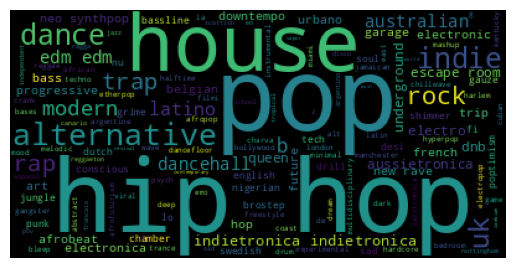 
    <i>Most Frequent Song Genres In FIFA Playlists</i>

FIFA playlists contain songs across a diverse set of genres but a few genres stand out in particular as a popular choice for EA Sport's picks:

- House
- Pop
- Hip Hop

Indie, dance, alternative, modern, and rock are also popular keywords. Additionally, although not as prominent, we also see a few region specific keywords, namely: Australian, UK, Belgian, French, Dutch, English, Nigerian, and Latino.

2014 | 2015 | 2016 | 2017 | 2018
:-------------------------:|:-------------------------:|:---------------------:|:---------------------:|:---------------------:
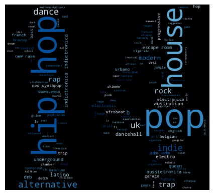  |  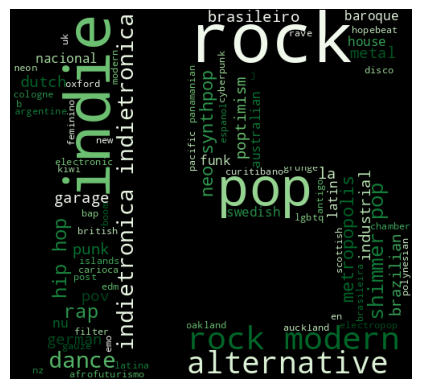 | 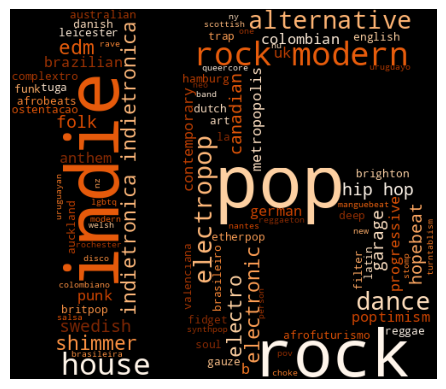 | 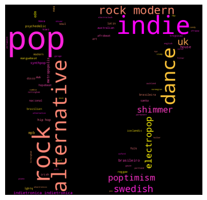 | 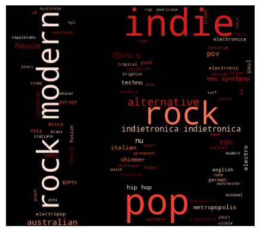

2019 | 2020 | 2021 | 2022 | 2023
:-------------------------:|:-------------------------:|:---------------------:|:---------------------:|:---------------------:
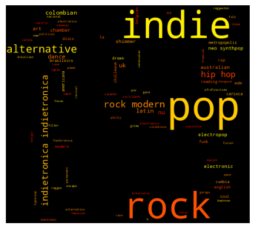  |  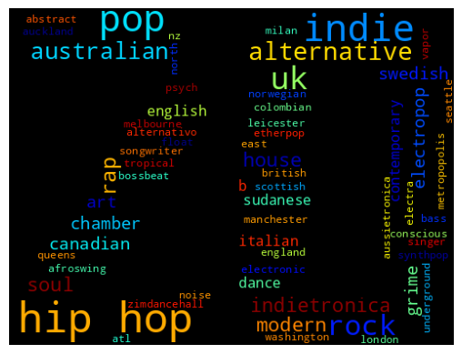 | 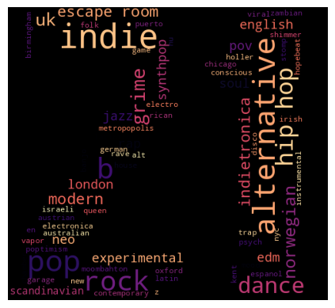 | 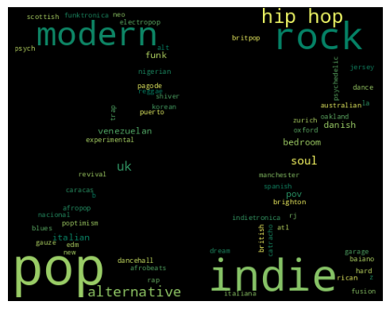 | 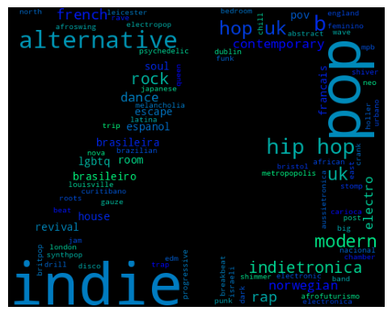

    <i>Wordclouds of the Most Frequent Song Genres Each Year</i>

Taking a closer look at how genre choices have changed over time, we arrive at several insights:
- Genre choice has definitely evolved over time. Categories such as House, Dance, and Rock went from being extremely popular in 2014 to being all but phased out by 2015. They were replaced by Indie, Pop, and Alternative, which are still the dominant categories today.
    - It's interesting that although house music was not a popular choice for most of the selected timespan, it is such a big part of the overall wordcloud. This suggests that it was extremely prominent when it was in fashion back in 2014.
- Hip hop has remained consistently popular throughout the 10 years.
- From 2020 onwards, there seems to be a more diverse mix of music in the playlist (popular genres are not as overwhelmingly dominant in the wordclouds)
- 2020 appeared to be a year with a very diverse selection of music- the sizes of the genres are more evenly spread out in the 2020 wordcloud.

#### Song and Album Data
Due to the abundance of new music every year and the propensity of FIFA playlists to reflect the most current musical trends, it would make sense that FIFA playlists each year are curated with songs released within the past year. This is evidenced in the chart below- at least 75% of the songs picked in each year's playlist were released within 1 year of the playlist compilation date.

    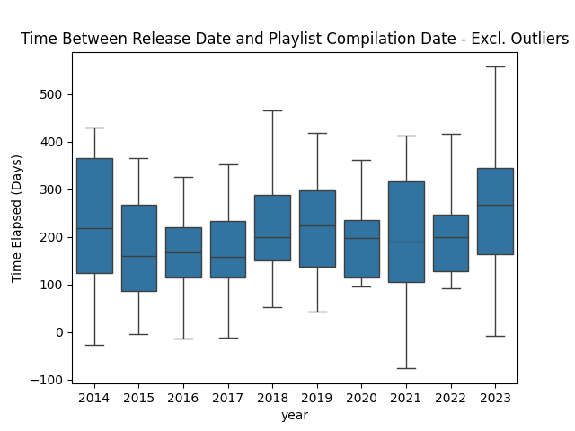 

The chart assumes that the playlist for each year was compiled on the first day of the year (eg. 2014-01-01). There are several negative numbers here, which is due to instances of the song being released prior to the album it is on (and it was assumed that the song and album release day are the same). The median time elapsed hovers consistently at around 200 days prior to playlist release. 2023's playlist had a median time elapsed of 268 days, which is significantly higher than the 200 days mark from previous years. This however may be due to the fact that the 2023 playlist was much larger than recent years (81 songs compared to 30-40 songs in years prior). As a result, EA Sports may have felt that it was appropriate to add more "throwback" songs on top of the songs from 2023. EA Sports also released a [World Cup playlist](https://www.theloadout.com/fifa-23/world-cup-mode-soundtrack) for FIFA 2023 which contained songs from prior playlists, which could suggest an emphasis on nostalgia and older songs.

    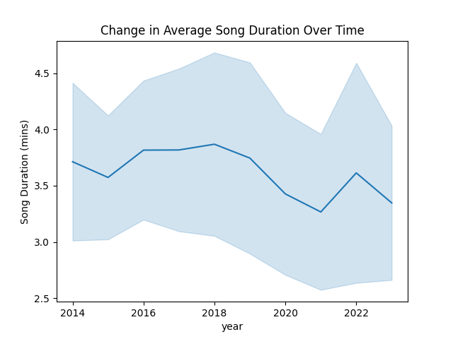 

In the above chart, the bands represent 1 standard deviation. There seems to be a wide range of song lengths, but most are 2.5 to 5 minutes long, which reflects the average song length in general. The average song length seems to be trending slightly downwards, but that could just be reflective of [overall industry trends](https://www.vice.com/en/article/qjv8pq/pop-songs-shorter-than-ever).

    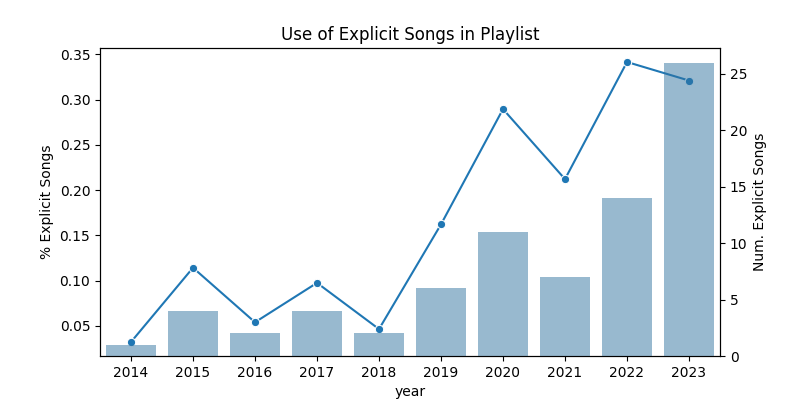 

Given that FIFA games are rated E for Everyone, it may be the case the playlist avoids explicit songs. This was definitely the case in 2014, with only 1 song being marked as explicit. However, though still a minority, the number of explicit songs as well as the proportion of songs in the playlist has been trending upwards. At the peak in 2022, a third of the playlist's songs were marked as explicit. 

    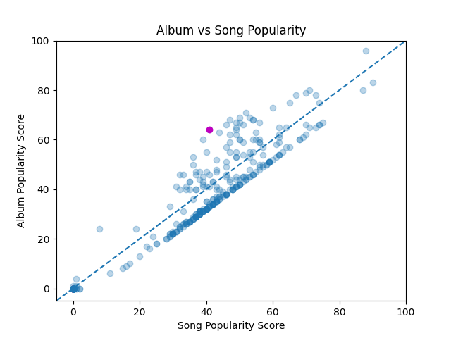 

I was hesitant to read too deeply into popularity scores because I suspect that a song's placement in the FIFA playlist heavily impacts its popularity score by increasing listenership. In the chart above, I plotted each song's popularity against its album popularity score. Points above the dotted line indicate that the album is more popular than the song, which would suggest that there are more popular tracks on the album (ie. the song was not the most popular song on the album). In the chart, we see there are more points under the line (48% under line, 20% over line), meaning that songs in FIFA playlists typically are the most popular songs in its album. 

We see that on average, points above the line are farther away from the line than points under the line. The farther above the line a song is, the less popular it is compared to the most popular song in the album. To illustrate this, the purple point on the graph represents the song "People" by *Kungs* and *The Knocks*. That song has 4.2M plays on Spotify, which pales in comparison to "Never Going Home" and "Clap Your Hands" in the album which have 265M and 118M plays respectively.

About 30% of songs have a popularity of 0. Since recent plays weigh more in Spotify's popularity scoring algorithm, This suggests that they haven't been played recently. The percentage of songs with a popularity score of 0 each year is illustrated in the chart below:

    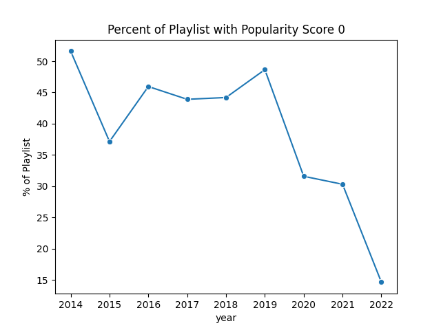 

This suggests that on average, the older the songs are, the less popular they get, which makes sense. However, it is surprising that the percentage isn't higher for the older playlists: except for 2014 (51% 0 popularity), a majority of each year's playlists have a non-zero popularity score. Whether or not the FIFA game is responsible for the sustained plays is unclear.

#### Artist Data

only one song per artist

assume that people only follow artist if they are really into them, so not as heavily influenced by being on fifa playlist as like play count or popularity

k means/ k mode to cluster into different categories, then find x songs that would fit in each category
diverse so cannot group together
30-40 songs total

#### Audio Data